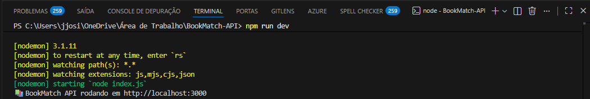
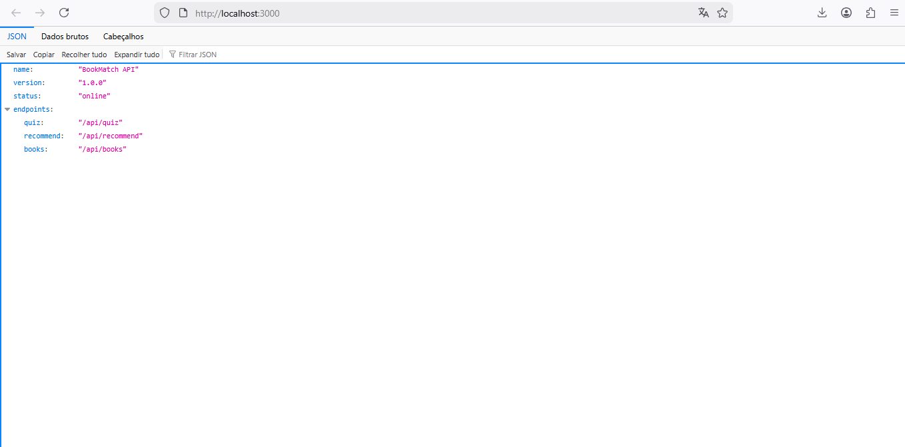
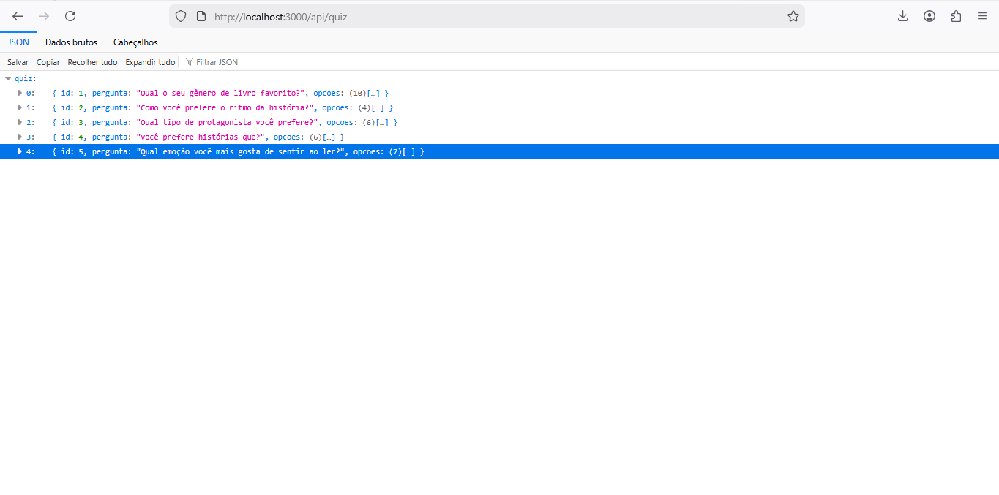
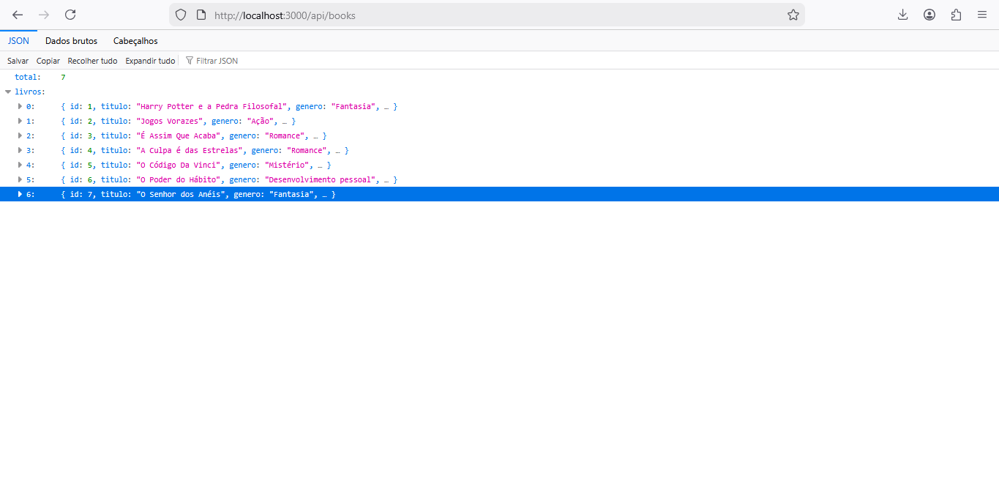

#  BookMatch API

API REST desenvolvida em **Node.js** para recomendação de livros com base nas respostas de um quiz de preferências.

Projeto criado com foco em **aprendizado em backend**, **organização de código** e **estruturação de APIs REST**.

---

##  Objetivo do projeto

- Praticar desenvolvimento de APIs REST
- Trabalhar organização de rotas
- Estruturar dados em JSON
- Aplicar lógica condicional
- Simular um sistema de recomendação simples
- Aprimorar lógica de backend

---

##  Funcionalidades

- Quiz com 5 perguntas
- Listagem de livros
- Recomendação baseada nas respostas
- Estrutura modular de rotas
- API RESTful
- Armazenamento em JSON
- Organização de endpoints

---

##  Tecnologias

- Node.js  
- Express.js  
- JavaScript  
- JSON  
- Nodemon  
- Git  
- GitHub  

---

## Endpoints

| Método | Rota            | Descrição                  |
|------|------------------|-----------------------------|
| GET  | /api/quiz        | Retorna perguntas do quiz   |
| GET  | /api/books       | Lista todos os livros       |
| POST | /api/recommend   | Retorna sugestões de livros |

---

## Estrutura do projeto

bookmatch-api/
│
├── index.js
├── package.json
│
├── routes/
│ └── index.js
│
├── data/
│ └── db.json
│
├── screenshots/
│ ├── terminal.png
| ├── root.png
│ ├── quiz.png
│ └── books.png
│
└── README.md

---

## Como executar

```bash
npm install
npm run dev
http://localhost:3000

---

## demonstração API

### API rodando no terminal


### Rota principal (root)


### Endpoint /api/quiz


### ❓ Endpoint /api/books


---

## Aprendizados

- Criação de APIs REST  
- Estruturação de rotas  
- Organização de projeto backend  
- Manipulação de JSON  
- Lógica condicional  
- Separação de responsabilidades  
- Estrutura modular  
- Boas práticas iniciais em backend  

---

## Próximas melhorias

- Sistema de pontuação por respostas  
- Filtros mais inteligentes  
- Banco de dados real (MongoDB ou PostgreSQL)  
- Autenticação de usuários  
- Documentação com Swagger  
- Integração com front-end  


